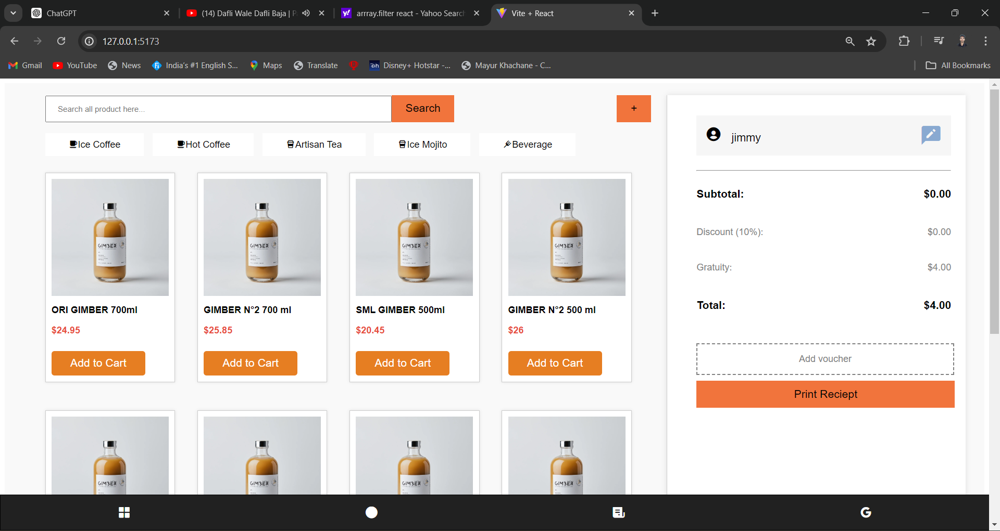

# Gimber E-Commerce Application

<h3>book your order at just one click</h3>

This is a responsive e-commerce application built with React that allows users to browse various Gimber products, add them to a cart, and view the cart summary. The application includes user-friendly features and a visually appealing interface.

## Features
Product Listing: Browse through a variety of Gimber products.
Search Functionality: Search for products using the search bar.
Category Filters: Filter products by categories like Ice Coffee, Hot Coffee, Artisan Tea, Ice Mojito, and Beverage.
Add to Cart: Add products to the cart with a single click.
Cart Summary: View the cart summary with detailed pricing, discounts, and total amount.

  Deploy Link -
  Netlify: https://66746d36f310b69a1450e5aa--willowy-crepe-839d42.netlify.app/

---

## Tech Stack Used: -

- #### Languages
  - `HTML`
  - `CSS`
  - `JavaScript `
  - `React`
  
---
## Running it locally

- run `npm install` or `yarn install`
- run `npm run dev`

### Screenshots :camera:

---
- **Home Page**
---

---

### About Project

> This is a responsive e-commerce application built with React that allows users to browse various Gimber products, add them to a cart, and view the cart summary. The application includes user-friendly features and a visually appealing interface.

---

